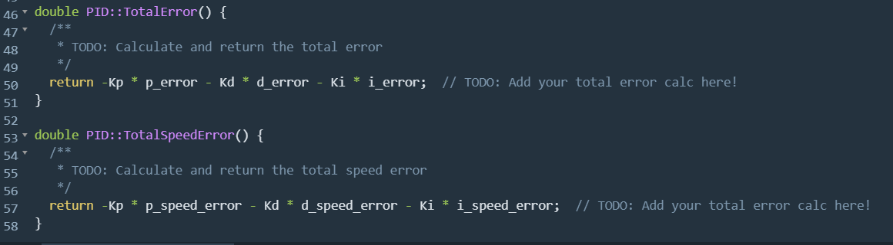

# CarND-Controls-PID
Self-Driving Car Engineer Nanodegree Program

---
## Project Description

* Goal: to programme your own PID comtroller to adjust the throttle value and the steering angle of the vehicle built in unreal engine to maintain the vehicle speed and keep it in lane.

* Implemention: 
  * Firstly, add the speed PID controller on the previous steering controller. Need to create new function. Then we can use throttle value to control the speed. 

  * Parameters trade-off: When select a higner Kp, the system could response faster but with bigger overshoot and oscillation.  Usually, select an Ki to eliminate steady state error. Using Kd to reduce overshoot. I tune the PID controller mannually. For steering system, increasing each parameters could affect the system performance in the way shown below.

    | Parameter  | Overshoot  | Rise Time  | Settling Time   | Steadystate error  |
    |---|---|---|---|---|
    | Kp  | Increase  | Decrease | Small change  | Increase  |
    | Ki  | Decrease  | Increase  | Increase  | Decrease  |
    | Kd  | Decrease  | Decrease  | Decrease  | No change  |

  * Parameters Selection: After manual tunning I found that increasing Kd over 0.1 could cause strong oscillation, so I did not use the Kd. To find an appropriate Kp, I started tunning with Kp=1 and decrease the value to decrease osillation and settling time. Also, I increased Ki with 0.1 as unit from 0 to check the system performance. I found when Ki= 0.95, system worked well. So the final parameters of steering system are selected as Kp = 0.11; Kd = 0; Ki = 0.95. The method to tune speed controller is same. 

  * Initiate the parameters of both speed controller and steering controller, here are my selected parameters.

## Project Result and Analysis
* I set my despired speed as 50 mph. Then I ran the simulation, the controller worked very well, performing with enough robustness.

## Dependencies

* cmake >= 3.5
* All OSes: [click here for installation instructions](https://cmake.org/install/)
* make >= 4.1(mac, linux), 3.81(Windows)
  * Linux: make is installed by default on most Linux distros
  * Mac: [install Xcode command line tools to get make](https://developer.apple.com/xcode/features/)
  * Windows: [Click here for installation instructions](http://gnuwin32.sourceforge.net/packages/make.htm)
* gcc/g++ >= 5.4
  * Linux: gcc / g++ is installed by default on most Linux distros
  * Mac: same deal as make - [install Xcode command line tools]((https://developer.apple.com/xcode/features/)
  * Windows: recommend using [MinGW](http://www.mingw.org/)
* [uWebSockets](https://github.com/uWebSockets/uWebSockets)
  * Run either `./install-mac.sh` or `./install-ubuntu.sh`.
  * If you install from source, checkout to commit `e94b6e1`, i.e.
    ```
    git clone https://github.com/uWebSockets/uWebSockets 
    cd uWebSockets
    git checkout e94b6e1
    ```
    Some function signatures have changed in v0.14.x. See [this PR](https://github.com/udacity/CarND-MPC-Project/pull/3) for more details.
* Simulator. You can download these from the [project intro page](https://github.com/udacity/self-driving-car-sim/releases) in the classroom.

Fellow students have put together a guide to Windows set-up for the project [here](https://s3-us-west-1.amazonaws.com/udacity-selfdrivingcar/files/Kidnapped_Vehicle_Windows_Setup.pdf) if the environment you have set up for the Sensor Fusion projects does not work for this project. There's also an experimental patch for windows in this [PR](https://github.com/udacity/CarND-PID-Control-Project/pull/3).

## Basic Build Instructions

1. Clone this repo.
2. Make a build directory: `mkdir build && cd build`
3. Compile: `cmake .. && make`
4. Run it: `./pid`. 

Tips for setting up your environment can be found [here](https://classroom.udacity.com/nanodegrees/nd013/parts/40f38239-66b6-46ec-ae68-03afd8a601c8/modules/0949fca6-b379-42af-a919-ee50aa304e6a/lessons/f758c44c-5e40-4e01-93b5-1a82aa4e044f/concepts/23d376c7-0195-4276-bdf0-e02f1f3c665d)

## Editor Settings

We've purposefully kept editor configuration files out of this repo in order to
keep it as simple and environment agnostic as possible. However, we recommend
using the following settings:

* indent using spaces
* set tab width to 2 spaces (keeps the matrices in source code aligned)

## Code Style

Please (do your best to) stick to [Google's C++ style guide](https://google.github.io/styleguide/cppguide.html).

## Project Instructions and Rubric

Note: regardless of the changes you make, your project must be buildable using
cmake and make!

More information is only accessible by people who are already enrolled in Term 2
of CarND. If you are enrolled, see [the project page](https://classroom.udacity.com/nanodegrees/nd013/parts/40f38239-66b6-46ec-ae68-03afd8a601c8/modules/f1820894-8322-4bb3-81aa-b26b3c6dcbaf/lessons/e8235395-22dd-4b87-88e0-d108c5e5bbf4/concepts/6a4d8d42-6a04-4aa6-b284-1697c0fd6562)
for instructions and the project rubric.

## Hints!

* You don't have to follow this directory structure, but if you do, your work
  will span all of the .cpp files here. Keep an eye out for TODOs.


## How to write a README
A well written README file can enhance your project and portfolio.  Develop your abilities to create professional README files by completing [this free course](https://www.udacity.com/course/writing-readmes--ud777).

